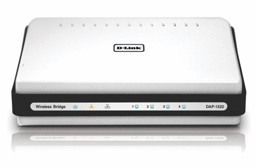

======================================
Wireless Access Point/Bridge: DAP-1522
======================================

I originally bought a `D-Link DAP-1522 <http://www.amazon.com/D-Link-Wireless-Gigabit-Extender-DAP-1522/dp/B001769K3O?tag=mhsvortex>`_ as a wireless bridge upstairs, before I got the :doc:`powerline adapters <powerline>`.

**As a wireless bridge, it's crap.** I really wanted to like it, but for some reason it never kept a connection to the wireless network. I can't tell you how many times I reset it to factory defaults or lost the ability to do any configuration on it at all.

**As an access point, it's great.** I've had no trouble using it as a second wireless access point to expand coverage in the house.