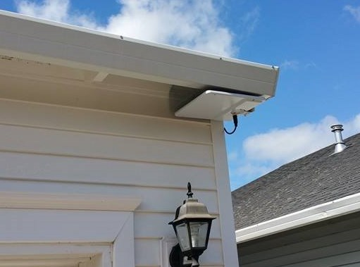

===============================
ChannelMaster CM 3000 SMARTenna
===============================

I picked up the `ChannelMaster CM 3000 SMARTenna <http://www.amazon.com/dp/B000BSKO84?tag=mhsvortex>`_ during :doc:`my plan to cut the cable <../../plans/cuttingthecable>`. It was a reasonable balance between cost, functionality, and ease of installation.

It was very easy to mount and it's paintable, so it blends right in. Here's a photo of the installed antenna, right above the light in the front of my house. I painted it white so you barely notice it. I also put some wire grating above it so animals don't make a home up there.

While it worked well in the summary, when the weather got bad the reception got a little flakey. At a certain point I started missing programs due to bad reception so I upgraded to the :doc:`ClearStream 2V HDTV Antenna <../network/clearstream2v>`.
