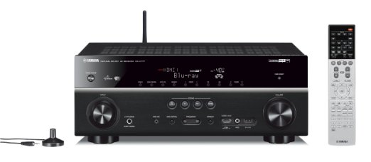

================
Yamaha RX-V777BT
================

I picked up my Yamaha RX-V777BT receiver in February 2015 after my :doc:`Onkyo TX-SR875 <onkyotxsr875>` receiver blew out its audio circuitry. `I picked it up at Amazon for around $800. <http://www.amazon.com/dp/B00ILCS164?tag=mhsvortex>`_

The setup on it was easy and the feature set is just right for me. It also came with a Bluetooth adapter that lets me play music from my phone right to the receiver, like a giant portable Bluetooth speaker.

**The killer feature, for me, is the standby HDMI passthrough.** It allows you to turn the receiver off (well, put it in standby mode) and still allow HDMI signals to be selected and pass through the receiver. You can watch stuff just through the TV without having to turn on the whole surround system.

The system was deprecated in March 2016 in favor of the :doc:`Marantz SR5010 <../receiver/marantzsr5010>`. The playback on this Yamaha was perfect but on occasion I'd hear a slight static coming from the left rear channel when a movie was paused or a game was paused. I couldn't find a pattern for it and it wouldn't always happen. When I reported the issue to the extended warranty company for investigation, they just sent me a check for the original purchase price and called it good. I wish I hadn't noticed the issue; I really did like this receiver.