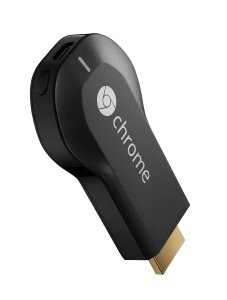

==========
Chromecast
==========

I picked up a `Google Chromecast <http://www.amazon.com/dp/B00DR0PDNE?tag=mhsvortex>`_ before I did too much evaluation or research on :doc:`front-end devices <../index>`.

While I found it was an interesting concept, **I had a lot of challenge with it around networking**. It took a lot of firmware versions after getting this thing in order to get it reliable.

The :doc:`NVIDIA Shield TV <nvidiashield>` has Chromecast built in so using the Chromecast protocol has been a more interesting thing of late.