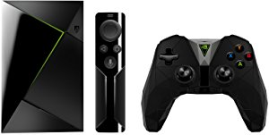

================
NVIDIA Shield TV
================

In August 2017, after months of instability from :doc:`my Roku Ultra <../deprecated/roku>`, I gave up on it and switched to `an NVIDIA Shield TV <http://amzn.to/2wy4Qxd>`_.

I chose that for a couple of reasons:

- Google Home integration: :doc:`Getting into home automation <../../plans/homeautomation>` we went with Google Home but we wanted something more robust for the front end than a Chromecast. This answers that question.
- Top-end 4K support: At the time we picked, this was one of the few devices that was getting 4K HDR support for all the services offering it.
- Tired of fighting: I usually try to balance price, performance, UX, features... and come to a middle ground. After my Roku Ultra experience I was tired of fighting for perf and decided to just throw money at the problem.

One of the downsides is that we use (and love) our `SideClick remote <http://amzn.to/2vY4Kxe>`_ and when we picked the NVIDIA Shield TV we found SideClick didn't have an adapter clip for it yet. I ended up shaping a small block of wood with a Dremel tool to enable the Shield remote to fit in the Roku remote clip for SideClick.