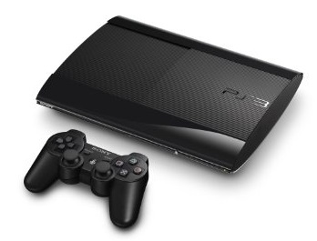

=============
Playstation 3
=============

We have a `Playstation 3 <http://www.amazon.com/dp/B009DL2TBA?tag=mhsvortex>`_ in the master bedroom downstairs attached to :doc:`the Sony TV <../tv/sonykdl40v2500>`. It serves as both a front end for the :doc:`services we use <../../services/index>` and a Blu-ray player.

Technically the one we have is one of the older backwards-compatible models, not the newer PS3 "slim."

I have had to replace the laser in my PS3. Discs started skipping and hanging for no apparent reason. I was afraid I might have to get a whole new PS3, but, facing that, figured I didn't have much to lose by trying to replace the laser or the whole PS3 drive.

My PS3 uses `the KES-410A / KES-410CA / KEM-410A / KEM-410ACA model laser <http://www.amazon.com/dp/B00DVP3HSI?tag=mhsvortex>`_ which I picked up for under $20. It took some time to open up the PS3 to get to the laser, but after it was replaced it worked like a champ. There are a ton of YouTube videos on how to replace the laser.

You can figure out which laser you need by `looking at the guide on this page (an alternate product photo) <http://www.amazon.com/dp/B00DVP3HSI?tag=mhsvortex>`_, but it helps to open up the PS3 before you order. I ordered based on the guide and it turned out my particular PS3 had a drive that was slightly different than average so I had to get a different laser.
