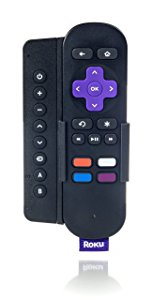
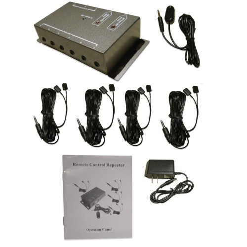
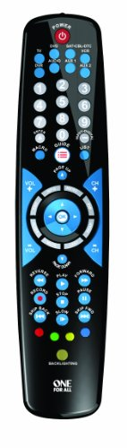
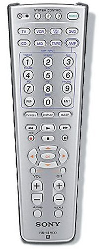
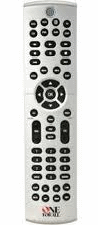
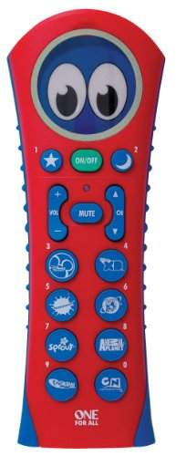

==============
Remote Control
==============

I found that `Remote Central <http://www.remotecentral.com/>`_ was indispensible when researching remote controls and asking questions.

Current
-------
Here are the set of remote control related items I'm using. **I've not solved the IR / radio control issue** where some devices are controlled through infrared signal and others are controlled through radio (e.g., Bluetooth). I've centralized my IR devices into a single remote, but I've not centralized the radio devices.

SideClick
~~~~~~~~~
`The SideClick is a small programmable remote <http://amzn.to/2vY4Kxe>`_ that hooks on the side of a Roku, Apple TV, or other streamer remote. Instead of trying to unify everything in One Big Remote, you can click a very simple remote to the streamer remote and you're done. We have one of these in every room and love them.

BAFX IR Repeater
~~~~~~~~~~~~~~~~
Given some of my devices are in cabinets or behind doors, I needed to get an IR repeater to "pipe" the remote signal to the devices that couldn't otherwise be controlled.

`This BAFX IR Repeater has been awesome <http://www.amazon.com/dp/B009ZGK6QS?tag=mhsvortex>`_ - cheap, easy to set up, and reliable. Just put the receiver unit somewhere in plain view and run it to the central relay box. Then run a little repeater cable from the box to the hidden device, adhering the repeater cable end to the spot on the device that normally receives remote signals.

One For All OARN08G
~~~~~~~~~~~~~~~~~~~
This is effectively the update for the Radio Shack 15-135. It controls 8 components, has great learning abilities, and just the right number of hard buttons. It also has a backlight. Not as fancy as a Harmony remote, but over time it has been very reliable and easy to reprogram as my theater device setup changes. I moved this up to the game room when we moved the :doc:`Samsung LN52A750 TV <../tv/samsungln52a750>` up there.

Deprecated
----------

These are remotes I used to use but don't any longer. I've kept the notes for reference.

Sony VL-900
~~~~~~~~~~~
`This was the first real universal remote I picked up and liked a lot. <http://www.amazon.com/dp/B00005I9Q0?tag=mhsvortex>`_

I used this in our game room until we moved the :doc:`Samsung LN52A750 TV <../tv/samsungln52a750>` up there. I had to switch to a different control because the volume button wouldn't "repeat" when you hold it down. `This is apparently a common thing with Samsung TVs. <http://www.remotecentral.com/cgi-bin/mboard/whichremote/thread.cgi?1201>`_

Radio Shack 15-135
~~~~~~~~~~~~~~~~~~
I got this as a replacement for the Sony VL-900. I'm pretty pleased with this remote - a good balance of hard buttons and learning functionality, and you can't beat the price. I picked it up in 2009 for $22. I used it until the buttons stopped working four years later.

One For All OARK02R
~~~~~~~~~~~~~~~~~~~
`I bought this for my daughter <http://www.amazon.com/dp/B001VTNBB4?tag=mhsvortex>`_ so she could control the TV all by herself. It is easy to program and makes her so proud to be able to turn it on and off or change channels. We moved away from this as she got a little older and when we picked up the SideClick, which is a good balance of convenience and kid-friendly.

