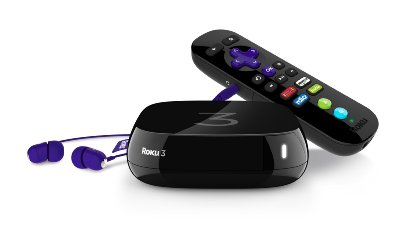

====
Roku
====

I picked up a `Roku 3 <http://www.amazon.com/dp/B00BGGDVOO?tag=mhsvortex>`_ after doing some comparison work between :doc:`Chromecast <chromecast>`, `Roku 3 <http://www.amazon.com/dp/B00BGGDVOO?tag=mhsvortex>`_, `Apple TV <http://www.amazon.com/dp/B007I5JT4S?tag=mhsvortex>`_, and `Amazon Fire TV <http://www.amazon.com/dp/B00CX5P8FC?tag=mhsvortex>`_.

While the Amazon site has `a comparison of Fire TV to Roku <http://www.amazon.com/dp/B00CX5P8FC?tag=mhsvortex>`_ and it appears to win (of course), `the majority of third-party reviews rank Roku 3 as the winner <http://www.cnet.com/news/chromecast-vs-apple-tv-vs-roku-3-which-media-streamer-should-you-buy/>`_.

.. `Roku has a Tablo channel <https://www.tablotv.com/blog/tablo-rockin-roku/>`_ so viewing :doc:`Tablo DVR <../server/tablo>` content is directly supported.