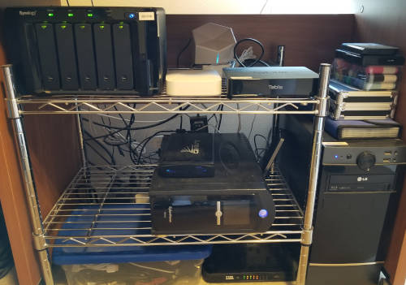

==================
Hardware / Devices
==================

There's a lot of hardware that goes into my media center. While some of it provides multiple functions, all of it plays a role on some level.

Here's a photo of my current server rack in my office. Most of these are discussed on the :doc:`server <server/index>` page, but there's some :doc:`network <network/index>` hardware in there as well as :doc:`a UPS <power/index>`.

:download:`Click for a larger view. <servers.jpg>`

From top to bottom, left to right, you see...

- :doc:`Synology DS1010+ <server/synologyds1010>`, which provides all storage.
- Some USB hard drives used with the :doc:`Tablo <server/tablo>`.
- :doc:`Tablo <server/tablo>`, which handles over-the-air DVR services.
- :doc:`HP EX475 Home Server <deprecated/hpex475>`, deprecated in late 2017.
- A USB hard drive that used to hold :doc:`CrashPlan <../software/deprecated/crashplan>` data, deprecated in late 2017.
- :doc:`CyberPower CP1500AVRLCD <power/index>`, the UPS that most (but not all) of this is plugged into.
- :doc:`D-Link DGS-2208 switch <network/switches>`, connecting these together and linking back to the main network.
- :doc:`Megaplex <server/megaplex>`, my custom dedicated Plex server.

For more detail on any of these things or items in the system that aren't pictured, dig in here.

.. toctree::
    :maxdepth: 2

    frontend/index.rst
    server/index.rst
    network/index.rst
    tv/index.rst
    receiver/index.rst
    speakers/index.rst
    power/index.rst
    deprecated/index.rst
