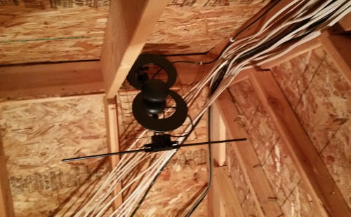

===========================
ClearStream 2V HDTV Antenna
===========================

I picked up the `ClearStream 2V Indoor/Outdoor HDTV Antenna with Mount - 60 Mile Range <http://www.amazon.com/dp/B007RH5GZI?tag=mhsvortex>`_ after my :doc:`my plan to cut the cable <../../plans/cuttingthecable>` when I found that the original antenna I purchased, the :doc:`ChannelMaster CM 3000 SMARTenna <../deprecated/cm3000>`, didn't work too well for me in inclement weather.

While the CM 3000 originally showed me channel scan signal ratings of between three and five (out of five) on the :doc:`Tablo <../server/tablo>`, the ClearStream 2V is all fives for every channel in my area even in the rain.

I mounted the antenna in the attic above my garage. It appears upside down compared to the pictures on Amazon, but it doesn't really matter and was the only way I could get it to fit given the mounting hardware had to be fitted to the roof.

