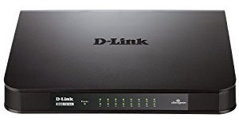

========
Switches
========

D-Link DGS-1016A
================

I have one `these D-Link DGS-1016A 16-port gigabit unmanaged switches <https://www.amazon.com/dp/B0092KZBCQ/?tag=mhsvortex>`_ in my network.

As I got into home automation and adding things like smart hubs in the office I needed more ports. I love my 8-port D-Link switches and this is the 16-port version.

D-Link DGS-2208
===============

I have two of `these D-Link DGS-2208 8-port gigabit unmanaged switches <http://www.amazon.com/dp/B000FITKK8?tag=mhsvortex>`_ in my network.

.. image:: dgs2208.jpg

There are cheaper items today (this is an older model), but these have been totally solid since I bought them. If/when I need new switches, I'll be looking at getting the updated version of this switch.

TP-LINK TL-SG1008D
==================

I have one `TP-LINK TL-SG1008D 8-port gigabit desktop switch <http://www.amazon.com/dp/B001EVGIYG?tag=mhsvortex>`_ in the network.

.. image:: tlsg1008d.jpg

I picked this up as an alternative to the DGS-2208 when I needed another switch upstairs but the DGS-2208 was an older model.

HP ProCurve 2810-24G
====================

When I updated to :doc:`Ubiquiti UniFi equipment <ubiquiti>` I replaced the two smaller unmanaged switches sitting under the desk with this larger 24-port managed switch.

It's a little older, but it does gigabit Ethernet and gets the job done.

I found the configuration via console to be somewhat challenging so I have a lot of notes about that.

Console Connection
------------------

To connect a console to the switch, use the console cable shipped with the switch and connect a PC or VT-100 terminal to the console serial port (e.g., PuTTY or KiTTY). The PC or terminal then functions as a management console connected directly to the switch.

Use the settings:

- A baud rate from 1200 to 115200 (the switch senses the speed)
- 8N1 (8 data bits, no parity, 1 stop bit)
- Xon/Xoff flow control

After connecting you won’t see anything happen immediately! Press Enter two or three times to have the switch sense the speed and finish connecting.

On Windows you can use the ``mode`` command to show the list of available COM ports. Note the USB COM port adapter may show the connection as something low like 1200 baud but you can set the terminal program to something higher and it works. Also, it may be better to connect the cable to the switch first and then attach the USB connector to the computer. It seems some auto-detection happens in that scenario.

Commands
--------

Hit ``TAB`` at the prompt to list commands. This also does autocomplete for commands where available.

- ``setup`` - launches the GUI menu
- ``config`` - starts configuration via CLI

Set timezone and network time protocol details (timezone is GMT offset in minutes)::

    2510_01# write memory
    2510_01# config
    2510_01(config)# time daylight-time-rule continental-us-and-canada
    2510_01(config)# time timezone -4800
    2510_01(config)# timesync sntp
    2510_01(config)# sntp unicast
    2510_01(config)# sntp server 10.10.20.69
    2510_01(config)# show time
    2510_01(config)# show sntp
    2510_01(config)# write memory

The SNTP server can be any reachable NTP server. You may have to use the GUI menu to tweak the "protocol version" on the SNTP server - using protocol 7 means it accepts pretty much anything from protocols 1 - 7. You may need to reboot the switch to force a sync, too.

Enable HTTP management and disable HTTPS. The switch is old enough that the HTTPS self-signed certificate isn't strong enough to satisfy browser requirements. Also, your browser needs to have Java on it so you may be stuck with IE11 or something::

    2510_01(config)# no web-management ssl
    2510_01(config)# web-management plaintext

Set manager and operator username and password::

    2510_01(config)# password manager user-name admin
    2510_01(config)# password operator user-name monitor

Save and view the configuration::

    2510_01(config)# write memory
    2510_01(config)# show run

