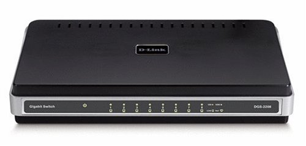
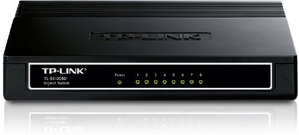

========
Switches
========

D-Link DGS-2208
===============

I have two of `these D-Link DGS-2208 8-port gigabit unmanaged switches <http://www.amazon.com/dp/B000FITKK8?tag=mhsvortex>`_ in my network.

There are cheaper items today (this is an older model), but these have been totally solid since I bought them. If/when I need new switches, I'll be looking at getting the updated version of this switch.

TP-LINK TL-SG1008D
==================

I have one `TP-LINK TL-SG1008D 8-port gigabit desktop switch <http://www.amazon.com/dp/B001EVGIYG?tag=mhsvortex>`_ in the network.

I picked this up as an alternative to the DGS-2208 when I needed another switch upstairs but the DGS-2208 was an older model.