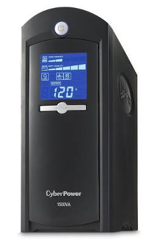
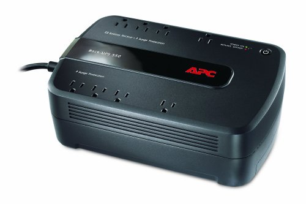
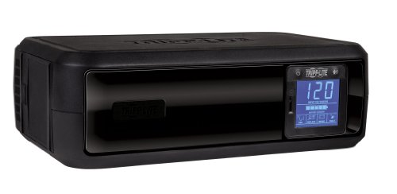

=====
Power
=====

All of my devices are, at a minimum, plugged into proper surge protection devices. In some cases, like the servers, I have UPS (uninterruptable power supply - battery backup) units that can save me in the event of an outage.

The UPS units in my office are connected to my servers via USB so they can monitor the UPS state. The :doc:`Synology DS 1010+ <../server/synologyds1010>` watches its UPS and are is to gracefully shut down if battery power gets too low.

General Power Requirements
==========================

I bought a `Kill-a-Watt <https://www.amazon.com/dp/B000RGF29Q?tag=mhsvortex>`_ to measure my power consumption in the computer room so I could determine the amount of UPS power I'd need. Normal values are estimated averages after observing general usage for a period of time. The Kill-a-Watt doesn't have an average function so I had to guess. In most cases there were rare spikes above this during peak usage but nothing that lasted long enough where I could get a good read.

====================================================================  ========  =========  ==============
Device                                                                Amps (A)  Watts (W)  Volt-Amps (VA)
====================================================================  ========  =========  ==============
FiOS Router - Normal                                                  0.2       14         24
:doc:`Windows Home Server <../deprecated/hpex475>` - Normal           0.65      63         68
:doc:`Windows Home Server <../deprecated/hpex475>` - Peak             1         92         98
:doc:`Synology DS 1010+ <../server/synologyds1010>` - Normal          0.5       55         60
:doc:`Xbox 360 <../frontend/xbox>` - Off/Sleep                        0.05      2          7
:doc:`Xbox 360 <../frontend/xbox>` - Normal                           0.9       75.6       103
:doc:`Dell Studio Hybrid <../deprecated/dellstudiohybrid>` - Off      0.03      1.3        3.6
:doc:`Dell Studio Hybrid <../deprecated/dellstudiohybrid>` - Sleep    0.04      2.3        5.3
:doc:`Dell Studio Hybrid <../deprecated/dellstudiohybrid>` - Normal   0.55      40         65
:doc:`Samsung LN52A750 TV <../tv/samsungln52a750>` - Off \*           0         0          0
:doc:`Samsung LN52A750 TV <../tv/samsungln52a750>` - Normal           2.07      240        241
:doc:`Playstation 3 <../frontend/ps3>` - Off                          0.03      1.4        3.8
:doc:`Playstation 3 <../frontend/ps3>` - Normal                       1.73      200        200
:doc:`Onkyo TX-SR875 <../deprecated/onkyotxsr875>` - Off \*           0         0          0
:doc:`Onkyo TX-SR875 <../deprecated/onkyotxsr875>` - Normal           1.59      145        185
====================================================================  ========  =========  ==============

\* Note that some of the devices that read 0 for all values when off would actually occasionally take a tiny sip of power very quickly and then go back to zero. No devices were ever totally 0 when off.

CyberPower CP1500AVRLCD
=======================
`I picked up two of these CP1500AVRLCD units <https://www.amazon.com/dp/B000FBK3QK?tag=mhsvortex>`_ after the Tripp-Lite OMNI900LCD units died. I really like these. They have a good capacity, plus the battery inside is replaceable so I can hopefully avoid the issue I had with the other units.

One of these is in the living room for the TV, receiver, and other front-end devices; one of these is in the office sharing the server load with an APS Back-Ups 550.

APC Back-Ups 550
================
`I bought one of these 550 units <https://www.amazon.com/dp/B0019804U8?tag=mhsvortex>`_ as a replacement for a busted Tripp-Lite OMNI900LCD and have been reasonably pleased with it.

The battery in this unit is replaceable, which is nice, but it doesn't have the display or control features that the CP1500AVRLCD or OMNI900LCD units have. You can't really tell the state of the battery or anything, which isn't awesome, nor can you silence the alarm without shutting the unit down.

That said, it's a decent value - not as expensive (or as feature-rich, or as powerful) as others, but if you need a little extra UPS support, this is pretty good.

Tripp-Lite OMNI900LCD
=====================

I have been through three of these over the course of five years. **I wouldn't recommend them.**

The problem is that the internal battery, which is not customer-serviceable, seems to go bad very quickly. You get one power outage and that's about it.

We had a power outage on 2/13/11 that caused my first Tripp-Lite OMNI900LCD UPS to stop responding. It was fine during the outage and lasted long enough for me to turn things off, but it wouldn't come back on and stay on because the battery went bad. I woke up several mornings after that and each day I found the computers had been shut down or rebooted because they lost power.

At the time I only had one of these devices. I filed a ticket with Tripp-Lite and while they were *taking their time addressing my questions*, I bought the APS Back-UPS 550 to replace it. Eventually Tripp-Lite sent me a replacement OMNI900LCD that I received on 3/15/11. I registered it for warranty that day... and it died just after the warranty ran out, again due to the battery.
