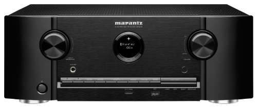

==============
Marantz SR5010
==============

The Marantz SR5010 was `picked up from Amazon for about $900 <http://www.amazon.com/dp/B010FH2J9W?tag=mhsvortex>`_ in March 2016 as a replacement for the :doc:`Yamaha RX-V777BT <../deprecated/yamaharxv777bt>`.

This is my first Marantz receiver and while I admittedly wasn't initially fond of the look of the unit, the setup and on-screen menu system is by far one of the easiest and most straightforward I've encountered.

This is the second unit I've had that's had the HDMI passthrough feature allowing you to use the receiver as a video switcher without keeping the unit turned on. I'm guessing this is a common feature now, but it's the little things like this that make it.

It's a native DLNA receiver so Bluetooth connectivity is less interesting than just "playing to" the receiver. You can cast audio or video at it without issue. (You can connect to it with Bluetooth if you want, however.)