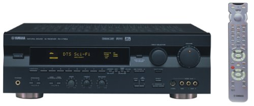

===============
Yamaha RX-V795a
===============

Despite the higher version number, this is an older model than the :doc:`RX-V777BT <../deprecated/yamaharxv777bt>` that serves as my primary receiver. I picked this up back around 2000 when it was a fairly new model.

I upgraded from this to the :doc:`Onkyo TX-SR875 <../deprecated/onkyotxsr875>` to get support for my 6.1 :doc:`Bose Acoustimass 16 <../speakers/acoustimass16>` speakers. I also wanted HDMI support. The RX-V795a now powers my game room via :doc:`Mirage MX satellite speakers <../speakers/miragemx>`.

Overall I really like this receiver. It's got fast video switching, it's quiet, it doesn't operate too hot, and it's reliable.