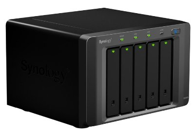

====================
Synology DS1010+ NAS
====================

The `Synology DS1010+ <http://www.amazon.com/dp/B0031ZKX5I?tag=mhsvortex>`_ is my primary storage server for video content. It has since been superseded by the `DS1515+ <http://www.amazon.com/dp/B00PTGQJL4?tag=mhsvortex>`_ but I've not seen any reason I need to upgrade. This DS1010+ serves me well and has really great performance and flexibility. I picked it up based on my :doc:`NAS research <../../plans/nas>`.

:doc:`Diskstation Manager (DSM) <../../software/system/dsm>` is the operating system that runs Synology NAS devices. It supports installation of packages that provide additional functionality (beyond just storage) from the device. Anything from Git to MySQL to :doc:`Plex <../../software/serve/plex>` can be run as a DSM package.

Plex Support
============
:doc:`Plex <../../software/serve/plex>` does have a package to allow you to run right on the Diskstation via DSM.

**The problem I ran into with Plex on the DS1010+ was transcoding support.**

Whenever you play a video that doesn't natively play on a device or can't handle the throughput, Plex transcodes the video to something the device can handle. For example, if I'm on a phone I might easily have the bandwidth to accommodate SD content, but I might not be able to accommodate HD content (or my phone's screen might have a lower resolution that can't display full HD), so Plex will try to step it down to accommodate the restrictions.

**The DS1010+ doesn't have enough CPU power to handle transcoding HD video with Plex, full stop.** I tried to configure the server and my various devices to avoid messing with transcoding but never could get the right setup. I'd get one :doc:`front-end device <../frontend/index>` working and it would cause some other device to start requiring transcoding. SD video? Great. HD? Nope.

This lack of power is why I built the :doc:`Megaplex custom server <megaplex>` to handle :doc:`Plex <../../software/serve/plex>` for me. I keep the storage on the DS1010+, I still run other packages and services, but Plex is specifically offloaded ot the dedicated machine to enable a smooth viewing experience.

Aside: Synology does provide a "Video Station" package that has similar functionality to Plex - serving video to different devices, transcoding, etc. - and it does allow the DS1010+ to transcode HD streams. It does this because it's very specifically tailored to the Synology DSM environment. Plex, serving a much wider range of hardware, doesn't include those customizations and there is no intention of doing so to my knowledge. This has seen a lot of discussion `on the Plex forums <https://forums.plex.tv/index.php/forum/133-synology/>`_. Note I didn't choose "Video Station" over Plex because Plex has a wider array of client support and a far nicer experience in general.

Storage
=======

    - I have a bunch of WD Green drives I pulled out of my :doc:`Windows Home Server <hpex475>`. Synology forums have some posts about this. `This one says that some of the drives work fine while others don't <http://forum.synology.com/enu/viewtopic.php?f=151&t=19131>`_; `this one is about someone who is trying to avoid issues by switching away from WD Green <http://forum.synology.com/enu/viewtopic.php?f=124&t=23719>`_. I decided not to use these and instead go with some other drives.
    - `I should get the latest firmware off the website <http://www.synology.com/support/download.php?lang=enu>`_ for initial install. This will make sure everything is compatible with newer disks.
    - `There is a hardware compatibility list for supported drives <http://www.synology.com/support/faq_show.php?q_id=130>`_ on Synology devices.

Of the 2TB drives listed as directly supported, these seem reasonably viable. Others are rated far too slow or are way beyond the $250/drive range (as of ~2010)...

    - Seagate Barracuda ST32000542AS is 5900RPM, 3Gb/s, 32MB cache. `$130 at NewEgg <http://www.newegg.com/Product/Product.aspx?Item=N82E16822148413&Tpk=ST32000542AS>`_, `$120 at Amazon <http://www.amazon.com/dp/B0028Y4CY6?tag=mhsvortex>`_. `A very favorable review here <http://hardwarelogic.com/articles.php?id=5578>`_ shows it outperforms an older performance-oriented model on all sorts of benchmarks, so spin speed isn't everything.
    - Seagate Barracuda XT ST32000641AS is 7200RPM, 6Gb/s, 64MB cache. `$250 at NewEgg <http://www.newegg.com/Product/Product.aspx?Item=N82E16822148506&Tpk=ST32000641AS>`_, `$270 at Amazon <http://www.amazon.com/dp/B002RWJHBM?tag=mhsvortex>`_.
    - Samsung Spinpoint HD203WI is 5400 RPM, 3Gb/s, 32MB cache. `$140 at NewEgg <http://www.newegg.com/Product/Product.aspx?Item=N82E16822152202&Tpk=HD203WI>`_, not at Amazon.
