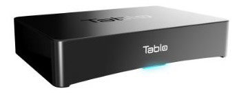
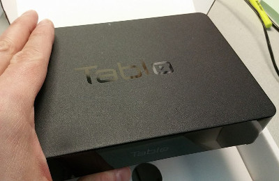

=====
Tablo
=====

As part of my :doc:`plan to cut cable <../../plans/cuttingthecable>` I added a `four-tuner Tablo OTA DVR <http://www.amazon.com/dp/B00MWLZR0I?tag=mhsvortex>`_ to the system.

The Tablo is pretty small, about the size of a paperback book.

With four tuners, I can record four things at the same time, or watch something and record three others, etc. I went for the four-tuner model rather than `the two-tuner model <http://www.amazon.com/dp/B00MWLZR0I?tag=mhsvortex>`_ because there are definitely a couple of shows we watch/record that run at the same time. I also wanted the ability to watch TV on a couple of different TVs while something was recording and that wouldn't have been possible without a couple of tuners.

Storage
=======
Storage on the Tablo is done by plugging in an external USB hard drive. I bought my Tablo on special where a 1.5TB drive was included and that's been working well. It's plenty of space, even recording things at the highest resolution.

Performance
===========
I've been able to very easily watch multiple streams at the same time. No hiccups, very nice. I was worried that it would start to stutter or buffer with multiple streams transcoding to different devices simultaneously, but it's been very smooth.

Comparison to Other DVRs
========================
I did the comparison to other DVR products (cost, services) as part of the :doc:`plan to cut cable <../../plans/cuttingthecable>`.