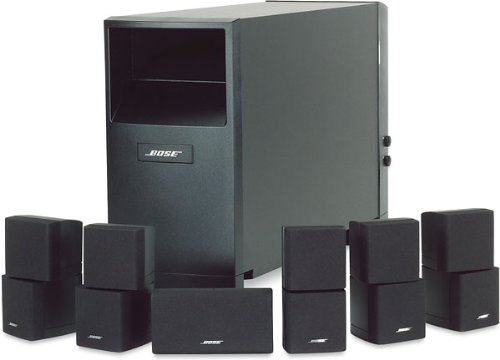

===================
Bose Acoustimass 16
===================

The `Bose Acoustimass 16 <http://worldwide.bose.com/productsupport/en_us/web/am16_series1/page.html>`_ series is a 6.1 surround satellite speaker set that was sold between 2002 and 2006. I picked mine up closer to the 2002 time when they were pretty new, upgrading from the 5.1 system I had to the 6.1.

These speakers are in my living room and run off the :doc:`Marantz SR5010 <../receiver/marantzsr5010>` receiver.

While I recognize there is some controversy out there about whether the price-for-sound is reasonable with Bose, I have to say I enjoy these speakers. They sound really good to me, though I'm sure some audiophiles will call my taste into question. The lows are rich, the mids are reasonable, and the highs are crisp.

Most of the time I'm watching, say, an action movie or listening to some over-compressed, over-produced dance music anyway, not trying to emulate a sound chamber with some classical music, so it's beyond good enough for me.

If I do upgrade, it'll be to get a 7.1 system... and I have to say, I'd definitely consider another Bose set.