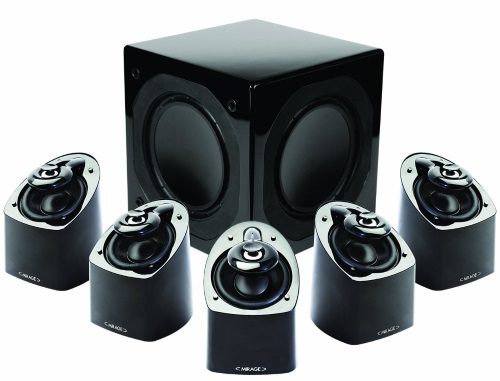

=========
Mirage MX
=========

A set of 5.1 Mirage MX satellite speakers serves my game room via the :doc:`Yamaha RX-V795a <../receiver/yamaharxv795a>` receiver.

I bought these as a more affordable alternative to getting a second set of :doc:`Bose Acoustimass 16 <acoustimass16>` speakers, particularly since the :doc:`Yamaha RX-V795a <../receiver/yamaharxv795a>` only drives 5.1 sound.

I've been actually very pleasantly surprised. The room they're in is not that big, and they're not very optimally placed given the crazy L-shape of the room, but they still sound pretty good. Overall, I feel like these were a solid buy.
