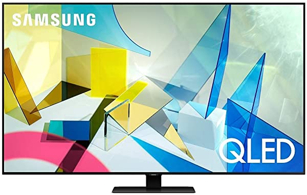

=====================
Samsung QN85Q80TAFXZA
=====================

This is a 85" 4K LCD set with a super thin bezel. We got this as an upgrade to the :doc:`UN65KS8000 <samsungun65ks8000>`.

When we remodeled the house a while back we had planned for a TV upgrade but didn't have the budget at the time. After 2020 and not really going anywhere or doing anything... surprise, we had the budget.

We went with this model because in the QXXT series (Q60T - Q90T), the Q60T and Q70T have a slightly inferior localized black and color solution; the technology is better in the Q80T and Q90T. However, the Q90T has extra stuff I don't need, so this is the "lowest model with the better technology."

It's taking a while to calibrate the picture to my liking. I need to turn up the shadow detail a bit because the localized dimming can get a little "extra" and drowns out dark pictures. I also find that, depending on the video source (e.g., Xbox, NVidia Shield, etc.) it may switch HDR profiles on me and each profile gets set up individually.

I ended up buying the "Geek Squad protection" for this for an extended two-year warranty. I normally don't do that, but I've been bitten a couple of times and sort of have a general rule that if it costs, say, more than $1500 I should at least consider it. I've actually used the warranty on some things and it's saved me a bit.
