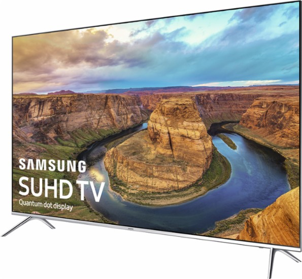

==================
Samsung UN65KS8000
==================

This is our current primary TV. It's a 65" 4K LCD set with a super thin bezel. We got this as an upgrade to the :doc:`LN52A750 <samsungln52a750>`.

We picked this one because we really liked the 52" set we were upgrading and compared to other sets we looked at this was far and away the best picture. We didn't want the curved screen because we wanted to wall mount the set which doesn't work so well with curved screens. The "triple black" technology built in (selectively brightens or dims areas on the screen to enhance dark areas) is definitely worth it.

The glossy display adds to the clarity of the picture, but I do need to basically keep the blinds in the room with the TV shut because any significant amount of light causes so much glare you can't see anything.
