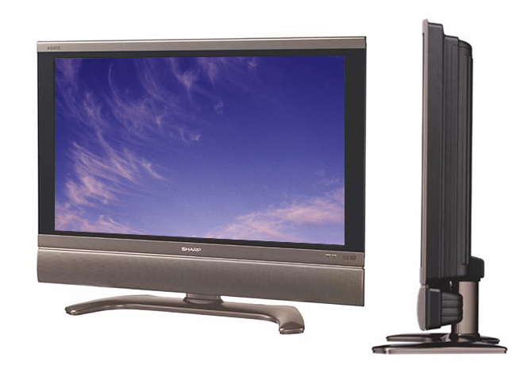

====================
Sharp Aquos LC-37D7U
====================

This is the first HD TV I bought. Its an LCD set with a native resolution of 1366x768. It displays at 720p, scaling things as needed. It's 37" and has a matte display. Controls are along the top right just behind the bezel.

Overall it's a decent performer but colors aren't super bright, nor are the darks very dark. At the time we bought it, it was better than many of the sets on the market but technology has progressed since then. I like the matte finish because you don't get the glare, but it does put a very slight haze on the picture.

When I was using it with the :doc:`Dell Studio Hybrid <../deprecated/dellstudiohybrid>` I had to do some research on the details of the TV to see if there was something I could do to possibly get a custom resolution running. I never ended up needing to do that, but I kept the notes.

- Vertical frequency of 60Hz is probably safe for any resolution.
- Horizontal frequency varies widely. 1280x768 is 48.1 kHz. 1280x720 is 45.0 kHz. 1280x1024 is 64kHz, which is the largest number listed in the book.
- The manual doesn't say the connection will support 1360x768 or 1366x768. The setting exists on the TV, though, so it should work.