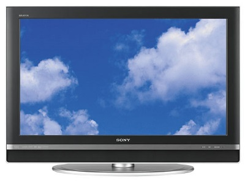

=======================
Sony Bravia KDL-40V2500
=======================

I got this TV in 2015 as a hand-me-down from my parents, who were upgrading to a brand new smart TV.

It's a pretty nice TV. The picture is reasonable, though I find the anti-glare matte finish takes some of the crispness out of it. All things being equal, I think I like the picture on Samsung sets a little better, but I've had a good brand history with Sony so I'm not looking to switch this out any time soon.
