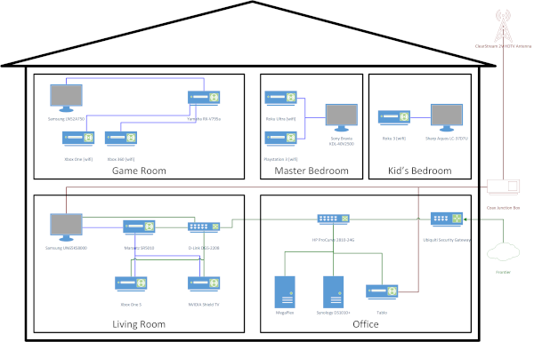

==================
Illig Media Center
==================

I love my media. *Love it.* Movies, TV shows, music... it's amazing.

I've amassed quite a collection, and I want to be able to enjoy it without a lot of hassle. I thought about it and came up with some general :doc:`requirements for what I want in a media center <requirements>`, then put the plan in motion.

**My current system works like this:**

- I have :doc:`a central server machine <hardware/server/megaplex>` that runs :doc:`Plex <software/serve/plex>` and serves content that is stored on :doc:`a network-attached-storage device <hardware/server/synologyds1010>`. That's how I get the media off disks and onto :doc:`front-end devices <hardware/frontend/index>`.
- I have a :doc:`Tablo <hardware/server/tablo>` DVR for handling recording over-the-air TV programs and serving them.
- I subscribe to :doc:`Netflix <services/netflix>`, :doc:`Amazon Prime <services/amazon>`, and :doc:`Pandora <services/pandora>` for content.
- At each TV in my house, I have an :doc:`Xbox 360 <hardware/frontend/xbox360>` or a :doc:`Roku <hardware/frontend/roku>` to access the content served by Plex and the various services.

It looks like this:

That, of course, is pretty high-level. You can dive into individual areas to read about the more detailed sections of the system. (If you want more on the diagram, :doc:`check out the network page <network/index>`.)

I started out `blogging <http://www.paraesthesia.com>`_ this information, but as time goes on, the blog entry updates upon updates get confusing... so I switched to documentation on `ReadTheDocs <https://readthedocs.org/>`_.

:doc:`Please read the disclaimer. <disclaimer>` You may find things in here that appear "wrong" or that don't work for you. I've addressed that :doc:`in my over-arching, all-encompassing disclaimer <disclaimer>`.

And now...

.. toctree::
    :maxdepth: 2

    requirements.rst
    network/index.rst
    hardware/index.rst
    software/index.rst
    services/index.rst
    formats/index.rst
    processes/index.rst
    plans/index.rst
    disclaimer.rst
