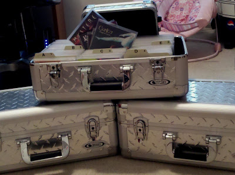

==========================
Audio/Music Intake Process
==========================

This is the process I go through when I get new music for my collection. Following this process helps me keep track of what I have (both for insurance purposes and so I don't buy duplicate stuff); and it makes sure I get everything into the system so it can be consumed by all of my devices.

1. Add the music to :doc:`iTunes <../software/manage/itunes>`. iTunes keeps my music files organized and enables me to sync the music to my iPods, iPad, and so on. Adding it to iTunes automatically copies the files to my :doc:`Synology DS1010+ NAS <../hardware/server/synologyds1010>` where it is picked up by :doc:`Asset UPnP <../software/serve/asset>` and :doc:`Plex <../software/serve/plex>` for serving to my devices.

    1. If the music is on a physical disc (CD), convert to Apple Lossless.
    2. If the music is digital (MP3), add by dragging the music files into the library.
    3. In all cases, update the digital file metadata to ensure artist, album, album art, etc. is all correct and consistent.

2. Add the music to :doc:`Music Collector <../software/manage/musiccollector>`.

    1. If the music is on a physical disc (CD), add by UPC.
    2. If the music is digital (MP3), add by music file.
    3. In all cases, synchronize the local collection database with `my online music collection database <https://cloud.collectorz.com/tillig/music/view>`_.

3. File the discs. I use `Odyssey CD Storage Cases <https://www.sleevecityusa.com/Odyssey-CD-Storage-Case-for-65-Jewel-Cases-p/3strody65.htm>`_ to store my CDs, each CD in a `Diskeeper sleeve <https://www.sleevecityusa.com/diskeeper-anti-static-cd-dvd-sleeve-p/3cdrice.htm>`_. I put the liner notes in the disc sleeve with the disc and I store any other paperwork in an expandable envelope.

