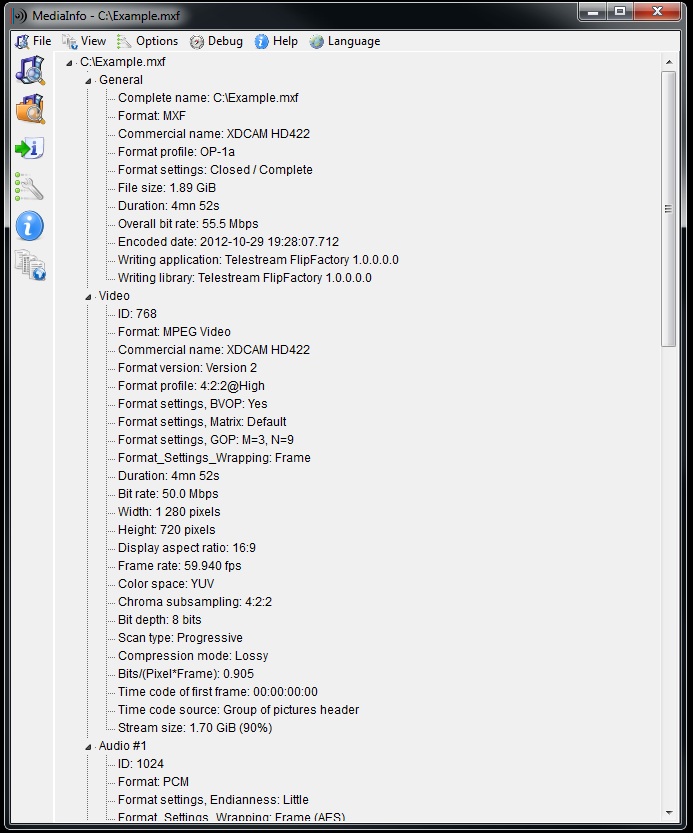

=========
MediaInfo
=========

`MediaInfo <https://mediaarea.net>`_ isn't really conversion software but it helps a lot with troubleshooting conversion issues.

What MediaInfo does is show you all sorts of data about what's in a media file, like this:

What's helpful about this is that after you run some conversions in :doc:`Handbrake <handbrake>`, you sometimes find that a movie didn't convert right, like it's displaying incorrectly or has a weird size; or maybe the sound isn't quite right. You can use MediaInfo to look at what the dimensions are for the video or what audio tracks it has. It will even show you the command parameters used by Handbrake to perform the conversion.

I've found a few times when I forgot to include the surround sound track in a movie or saw I'd converted using incorrect dimensions by looking in here. Definitely worth checking out.